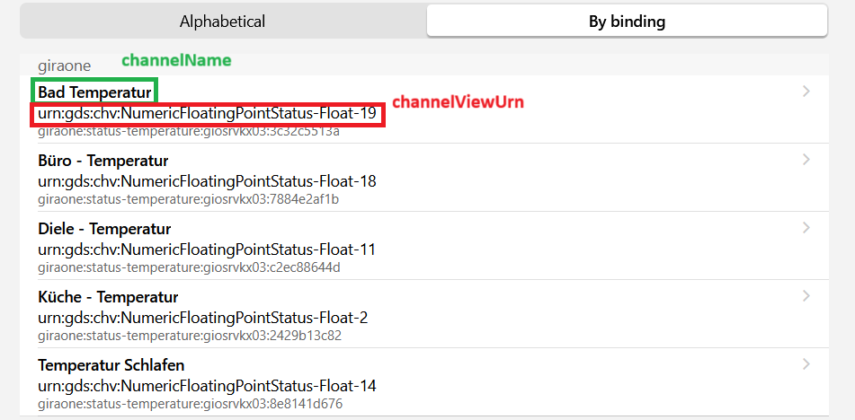

# Gira One Binding
The [Gira One System](https://www.gira.com/en/en/products/systems/gira-one) offers a smart home solution on top of KNX 
without the need of using the Engineering Tool Software (ETS) for setting up your smart home system. 
Your [Smart Home Setup](https://partner.gira.com/data3/GiraOneSystemhandbuch_EN.pdf) will be done via the [Gira Projekt Assistent (GPA)](https://partner.gira.com/en/service/software-tools/gpa.html) 
and you're able to control your home by using the [Gira Smart Home App](https://partner.gira.com/en/service/apps.html?searchphrase=smart+home+app) which communicates 
with the Gira One Server through your IP network.

## Disclaimer
The whole communication between the openhab binding and the Gira One Server was reverse engineered by performing actions 
within the Smart Home App and analysing the network communication within the contributor's system. Therefore, there are 
some functional gaps and not every use cas is full covered.  

*We need your help to get the things better. Please let me know what's working well, what might be better and what's not 
working as expected.*

## Supported Things
This binding offers a bridge and let the things communicate with the gira one server via your local IP network.   

- `giraone:server`: The bridge between openhab and Gira One Smart Home. The Gira One Server must have a Firmware Version of _2.0.108.0_
- `giraone:status-humidity`: Measures a room's humidity . 
- `giraone:status-temperature`: Measures a room's temperature.
- `giraone:dimmer-light`: Controls Light On/Off and dimming with status information.
- `giraone:switch-lamp`: Switches a lamp On/Off and offers status information.
- `giraone:switch-power-outlet`: Switches a power outlet and offers status information.
- `giraone:shutter-venetian-blind`: Offers information about shutter position and let the shutter move up/down.
- `giraone:heating-cooling-underfloor`: Sets the temperature for your underfloor heater and gives some status information.
- `giraone:shutter-roof-window`: Offers information about roof window position and open/closes the window.
- `giraone:shutter-awning`: open/closes the awning.
- `giraone:function-scene`: executes a function scene as configured within the Gira Smart Home
  
## Discovery
The Gira One Server Binding is getting discovered within the local network via UPNP. After entering the credentials, 
all available things are getting discovered as well and will be sent to the _Things Inbox_. 

##  Binding Configuration 

It's only needed to configure the binding `giraone:server` itself. After the project setup is getting fetched from the gira one server after creating a connection.  

| Name                     | Type    | Description                                                                                                  | Default | Required | Advanced |
|--------------------------|---------|--------------------------------------------------------------------------------------------------------------|---------|----------|----------|
| hostname                 | text    | Hostname or IP address of the Gira One Server                                                                | N/A     | yes      | no       |
| username                 | text    | Username to access the device, defined by GPA                                                                | N/A     | yes      | no       |
| password                 | text    | Password to access the device, defined by GPA                                                                | N/A     | yes      | no       |
| tryReconnectAfterSeconds | integer | How many seconds should be waited before trying a reconnect on as serverside closed connection (e.g. reboot) | 60      | no       | yes      |
| defaultTimeoutSeconds    | integer | How long should be waited on any answer before failing?                                                      | 60      | no       | yes      |
| maxTextMessageSize       | integer | Maximum number of kBytes to accept from Gira One Server as single message.                                   | 350     | no       | yes      |

## Things

### Thing `giraone:status-humidity`
Gives information about a room's humidity.

#### Channels

| Channel | Type                  | Read/Write | Description               |
|---------|-----------------------|------------|---------------------------|
| float   | Number:Dimensionless  | R          | Atmospheric humidity in % |


### Thing `giraone:status-temperature`
Gives information about a room's temperature.
#### Channels

| Channel | Type                 | Read/Write | Description                |
|---------|----------------------|------------|----------------------------|
| float   | Number:Temperature   | R          | Measured temperature in °C |

### Thing `giraone:dimmer-light`
Controls Light On/Off and dimming with status information.
#### Channels

| Channel     | Type   | Read/Write | Description                                                                                                                                         |
|-------------|--------|------------|-----------------------------------------------------------------------------------------------------------------------------------------------------|
| on-off      | Switch | RW         | Controls the switch's On/Off state. This channel depends on channel `brightness`.                                                                   |
| brightness  | Dimmer | RW         | Sets the light's brightness value between 0% and 100%. A brightness value of 0 means switch to Off state. A value greater than 0 triggers On state. |

### Thing `giraone:switch-lamp`
Switches a lamp On/Off and offers status information.
#### Channels

| Channel  | Type   | Read/Write | Description                          |
|----------|--------|------------|--------------------------------------|
| on-off   | Switch | RW         | Controls the switch's On/Off state   |

### Thing `giraone:switch-power-outlet`
Switches a power outlet and offers status information.
#### Channels

| Channel | Type   | Read/Write | Description                               |
|---------|--------|------------|-------------------------------------------|
| on-off   | Switch | RW         | Controls the power outlet's On/Off state |

### Thing `giraone:shutter-venetian-blind`
Controls a venetian bind shutter.
#### Channels

| Channel       | Type                 | Read/Write | Description                                                                                             |
|---------------|----------------------|------------|---------------------------------------------------------------------------------------------------------|
| step-up-down  | Rollershutter        | RW         | Raise or Lower the Blind Level by Single Step                                                           |
| up-down       | Rollershutter        | RW         | Move the Blind Level Up or Down                                                                         |
| motion        | String               | RW         | Is currently in motion or stopped. Possible values are `HALTED`, `MOVING`, `MOVING_UP` or `MOVING_DOWN` |
| position      | Rollershutter        | RW         | Set Blind Level to Position                                                                             |
| slat-position | Number:Dimensionless | RW         | Change or View Slat Position                                                                            |


### Thing `giraone:heating-cooling-underfloor`
Sets the temperature for your underfloor heater and gives some status information.
#### Channels

| Channel   | Type               | Read/Write | Description                                                                                                                              |
|-----------|--------------------|------------|------------------------------------------------------------------------------------------------------------------------------------------|
| current   | Number:Temperature | R          | The current measured temperature                                                                                                         |
| set-point | Number:Temperature | RW         | Change this value to the desired temperature between 5°C and 35°C                                                                        |
| heating   | Number             | RW         | Shows up, if the heater is warming. 0 means Standby (no heating), 1 heater is feeding.                                                   |
| mode      | Number             | RW         | The Heater Working Profile. One of Comfort(1), Standby(2), Night(3), Freeze Protection(4). The values are given by the Gira One System.  | 

### Thing `giraone:shutter-roof-window`
Offers information about roof window position and open/closes the window.

#### Channels

| Channel       | Type          | Read/Write | Description                                                                                             |
|---------------|---------------|------------|---------------------------------------------------------------------------------------------------------|
| step-up-down  | Rollershutter | RW         | Raise or Lower the Window Level by Single Step                                                          |
| up-down       | Rollershutter | RW         | Move Window Level Up or Down                                                                            |
| motion        | String        | R          | Is currently in motion or stopped. Possible values are `HALTED`, `MOVING`, `MOVING_UP` or `MOVING_DOWN` |
| position      | Rollershutter | RW         | Set Window Level to Position                                                                            |

### Thing `giraone:shutter-awning`
open/closes the awning.
#### Channels

| Channel       | Type          | Read/Write | Description                                                                                            |
|---------------|---------------|------------|--------------------------------------------------------------------------------------------------------|
| step-up-down  | Rollershutter | RW         | Moves the Awning In or Out by Single Step                                                              |
| up-down       | Rollershutter | RW         | Move Awning Level In or Out                                                                            |
| motion        | String        | R          | Is currently in motion or stopped. Possible values are `HALTED`, `MOVING`, `MOVING_IN` or `MOVING_OUT` |
| position      | Rollershutter | RW         | Set Awning Level to Position                                                                           |

### Thing `giraone:function-scene`
executes a function scene as configured within the Gira Smart Home
#### Channels

| Channel | Type   | Read/Write | Description                                                                                                                                                     |
|---------|--------|------------|-----------------------------------------------------------------------------------------------------------------------------------------------------------------|
| execute | Number | W          | Triggers the execution of a Configured Gira One Scene with. The Default Value is 0. Set to 1 for triggering scene variant 1. Set to 2 for variant 2 and so on   |


## Full Example

### Thing Configuration by channelViewUrn
If you want to configure your thing manually, you need to find out the concerning `channelViewUrn` or `channelName`. You should prefer using the channelViewUrn, because it's more stable and
changes only if the hardwired installation is changed. There are two option to get this value.

#### Extract channelViewUrn from Service Discovery Result
You can extract the information from your Things Inbox.


#### Extract channelViewUrn from logfile
- Set addon's loglevel to `TRACE`
- Lookup the log for a received message `GetUIConfiguration` 
```
  openhab.log:2025-03-27 08:05:31.527 [TRACE] [internal.communication.GiraOneClient] - Received Message :: {"response":{"request":{"urns":true,"_gdsqueryId":3,"command":"GetUIConfiguration"},"error":{"code":0,"text":"OK","hint":""},"config":[ 
``` 
- Now find the desired channel within the message.
```json
 {
        "channelViewID": 216302,
        "channelViewUrn": "urn:gds:chv:NumericFloatingPointStatus-Float-16",
        "functionType": "de.gira.schema.functions.NumericFloatStatus",
        "channelType": "de.gira.schema.channels.Float",
        "channelTypeId": "NumericFloatStatus.Temperatur",
        "name": "Wohnen Temperatur",
        "iconID": 108,
        "dataPoints": [
          {
            "dataPoint": "Float",
            "id": 215501,
            "urn": "urn:gds:dp:GiraOneServer.GIOSRVKX03:KnxButton4Comfort2CSystem55Rocker3-gang-3.Roomtemperature-1:Temperature"
          }
        ],
        "parameters": [],
        "channelID": 0,
        "switchTimeChannelID": 0,
        "switchTimes": []
      }
```

```java
Bridge giraone:server:123456789 "Gira One Server" @ "Schaltschrank" [ hostname="192.168.123.123", username="User", password="TheSecretWord" ] {
    Thing status-temperature Wohnen_Temperatur_1    "Temperatur Wohnen by channelViewUrn "    [ channelViewUrn="urn:gds:chv:NumericFloatingPointStatus-Float-18" ] 
}
```

### Thing Configuration by channelName
You may also reference the Thing by it's name as given in the Gira GPA software. You need to reconfigure the things if  the channel is renamed in the GPA Software or in the Gira Mobile App. 
```java
Bridge giraone:server:123456789 "Gira One Server" @ "Schaltschrank" [ hostname="192.168.123.123", username="User", password="TheSecretWord" ] {
    Thing status-temperature Wohnen_Temperatur_2    "Temperatur Wohnen by channelName"    [ channelName="Wohnen Temperatur" ]
    Thing status-temperature Wohnen_Temperatur_3    "Wohnen Temperatur"    [  ]
}
```

### Item Configuration

```java
Number:Temperature    T_Wohnen_Temperatur_2    "Wohnen Temperatur  [%.1f %unit%]"   ( WOHNEN )  [ "Point" ]    { channel="giraone:status-temperature:123456789:Wohnen_Temperatur_2:float" [  ] }  
```


## Additional Information
This chapter gives some additional information about the binding.
### Known Issues
n.a.

### Planned Extensions
n.a.

